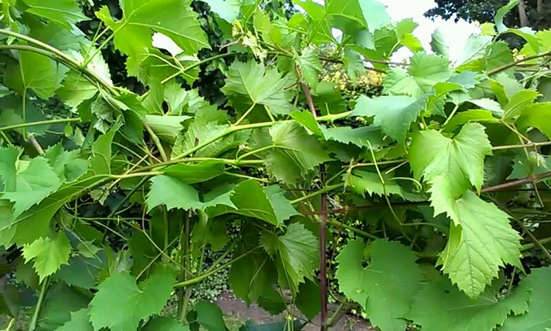
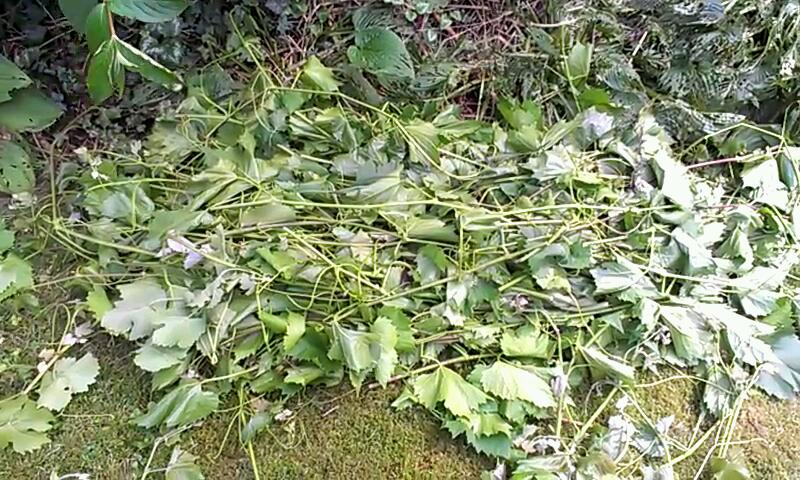

## Samenvatting

Wijnbouwers streven naar een luchtige loofwand om schimmelziekten op het blad te voorkomen en de suikerproductie te optimaliseren (bladeren die in elkaars schaduw hangen verbruiken suikers in plaats van ze te produceren). Sommige druivenrassen, zoals Solaris, Marechal Foch, Golubok en Rondo, hebben de neiging om veel okselscheuten te produceren, waardoor een dichte loofwand ontstaat.  
Voor de wijnbouwer betekent het weghalen van okselscheuten extra werk, waar men met name in de commerciele wijnbouw niet op zit te wachten.

Er zijn diverse methoden om de groei van okselscheuten te temperen. Dit artikel beschrijft mijn ervaringen met één methode, de zogenaamde 'palissage', waarbij de topscheuten na het bereiken van de bovenste draad niet worden getopt, maar horizontaal of naar beneden worden omgebogen.  
De theorie hierachter is dat de druif, die van nature een klimplant is en vanuit de top dóór wil blijven groeien, zijn 'energie' naar zijn top blijft sturen in plaats van zijscheuten te ontwikkelen.

Mijn ervaringen met palissage zijn opgedaan nadat ik een oproep kreeg van Justine Vanden Heuvel, een Associate Professor of Viticulture aan Cornell University (USA), en haar afstudeerder Justin France om mee te doen aan een experiment met Palissage.  
Mijn conclusies zijn dat de groei van okselscheuten inderdaad kan worden verminderd, maar dat de hoeveelheid werk in de wijngaard niet significant verminderd en zelfs complexer wordt. Doordat er ook nadelen aan deze methode kleven ga ik niet verder met deze methode en zal ik weer op de gebruikelijke wijze meerdere keren in het seizoen de okselscheuten verwijderen.

Voor wie nieuwsgierig is naar mijn motivatie; lees verder!

## Opzet

Hieronder volgt een korte beschrijving van de opzet van het palissage experiment in mijn wijngaard "De Achthoeven".

### Druivenrassen
De twee druivenrassen, [Marechal Foch](http://www.brabantsewijnbouwers.nl/index.php?section=13&page=37&student=594) en [Solaris](http://www.brabantsewijnbouwers.nl/index.php?section=13&page=133&student=409), werden gekozen op basis van hun sterke groei en nijging om okselscheuten en een dichte loofwand te ontwikkelen. Beide rassen groeien op [SO4 onderstam](http://iv.ucdavis.edu/Viticultural_Information/?uid=177&ds=351).

### Bodem-type
De bodem bestaat uit "[Enkeerdgrond](https://nl.wikipedia.org/wiki/Eerdgronden)" op fijn zand. Enkeerdgronden zijn zandgronden met een ongeveer 40 à 50 cm dikke humushoudende bovengrond die is ontstaan door opmesting met zandrijke potstalmest. De grond is niet erg vruchtbaar, iets zuur met een pH van 6,5 en mineralen spoelen snel uit. De afwatering is goed.

### Palissage type
De vier rijen, met ieder 10 stokken, staan in noord-zuid richting, met een overheersende windrichting vanuit het zuid-westen. De twee buitenste rijen weren geselecteerd voor de palissage, de binnenste rijen dienden als ‘controle’ en werden op traditionele wijze getopt.

Het toegepaste type palissage bestond uit het horizontaal wikkelen van de topscheuten rond de top-draad op 2m hoogte ('shoot tuck'). NB een alternatieve methode van palissage is om de topscheuten naar beneden toe uit te buigen ('shoot wrap').

## Groeiseizoen 2015

### Klimaat

Het groeiseizoen startte half april, iets voor het langjarig gemiddelde, na een lange, maar milde winter. De maanden mei en juni waren iets koeler dan gemiddeld, maar met veel zon en weinig regen. Juli was warmer dan gemiddeld en opnieuw droog.  
Een groot deel van het groeiseizoen van 2015 behoorde tot de 5% droogste jaren sinds het KNMI in 1705 begon met waarnemingen. Dit veranderde eind juli, toen op één dag 30mm viel, gevolgd door meer regen half augustus. Vanaf dat moment wisselden zon en regen elkaar af, waarbij de temperatuur rond het langjarig gemiddelde lag. Deze omstandigheden zorden voor een verhoogd risico op schimmelinfecties in de wijngaard.  
Dit weertype continueerde in september, waarbij de temperatuur iets lager lag dan het langjarig gemiddelde.

Het verloop van de beschikbare hoeveelheid vocht en een maat voor de temperatuur tijdens het groeiseizoen worden getoond in de volgende figuren.

Het neerslagtekort, gemiddeld voor heel Nederland, is te zien als de zwarte lijn in figuur 1. De blauwe lijn toont de mediaan, de groene lijn de 5% droogste jaren en de rode lijn het recordjaar 1976.

{ width=450px }

Figuur 2 toont de [Huglin-index](https://de.wikipedia.org/wiki/Huglin-Index), een maat voor de hoeveelheid groeizame dagen gedurende het groeiseizoen. De Huglin-index wordt verkregen door de gemiddelde dagtemperatuur minus een basis tempteratuur over het groeiseizoen te sommeren. De basis temperatuur komt overeenkomt met de temperatuur waaronder een plant in rust is en niet meer groeit (voor druiven 10 graden Celsius).  
De figuur toont het langjarige gemiddelde (donker rode lijn) en de waarden voor 2015 (de licht rode lijn). Daarnaast zijn ter referentie de groeistadia voor de Rondo weergegeven en de waarde van de Huglin-index bij de oogst van verschillende bio- en traditionele druivenrassen.

{ width=600px }

Tot aan de oogstperiode kan het groeiseizoen als een gemiddeld jaar worden gezien. Tegen de oogst werd de temperatuur lager en viel er meer neerslag.

### Ontwikkelingstadia Marechal Foch en Solaris

In tabel 1 zijn een aantal van de belangrijke ontwikkelingsstadia van de Marechal Foch en Solaris gedurende het groeiseizoen van 2015 weergegeven.

[BBCH-schaal](https://en.wikipedia.org/wiki/BBCH-scale_(grape)) | Stadium | M.Foch | Solaris
---- | --------------------- | ----------- | -----------
05 | wol-stadium | 10-4-2015 | 10-4-2015
09 | knoppen breken | 22-4-2015 | 23-4-2015
11 | 1e blad | 25-4-2015 | 27-4-2015
13 | 3e blad | 1-5-2015 | 5-5-2015
15 | 5e blad | 11-5-2015 | 13-5-2015
61 | 10% bloei | 6-6-2015 | 10-6-2015
68 | 80% bloei | 14-6-2015 | 25-6-2015
73 | korrelgrootte | 24-6-2015 | 30-6-2015
83 | verkleuring | 10-8-2015 | 30-7-2015
89 | oogst | 11-10-2015 | 20-9-2015

## Activiteiten in de wijngaard

### Zomersnoei

De eerste scheuten bereikten de topdraad rond 5 juni. De eerste keer toppen vond plaats op 10 juli, toen de scheuten 100-150cm ‘over’ de topdraad waren gegroeid. De beide binnen-rijen werden met een heggenschaar gesnoeid, de beide buiten-rijen werden met de hand horizontaal uitgebogenm, waarbij de scheuten rond de topdraad werden gewikkeld.

NB door het hangen van de 100-150cm lange topscheuten heb ik hierdoor bij alle stokken tot 10 juli in feite de 'shoot wrap' methode toegepast.

Tabel 2 toont de tijd die werd besteed aan het snoeien en wikkelen:

variëteit | methode | tijd/stok (minuten) | 'gemak'
----------- | ----------- | ----------- | -----------
M.Foch | snoei	 | 1.5 à 2.0 | 	2
M.Foch | wikkelen | 	2 | 	6
Solaris | snoei	 | 1 | 	2
Solaris | wikkelen | 	2.5 | 	6

*Opmerkingen en observaties:*

  - de kolom 'gemak' geeft aan hoe eenvoudig de methode kon worden toegepast op een schaal van 1 tot 10, waarbij 1 staat voor 'technisch eenvoudig en snel', 5 staat voor 'enige technische leercurve en inspanning' en 10 voor 'moeilijk en tijdsintensief'.
  - de tijd die werd besteed aan het snoeien was inclusief de afvoer van het snoeimateriaal.
  - bij het toppen werd geprobeerd om zoveel mogelijk de scheuten te snoeien en bladschade te voorkomen.
  - het wikkelen kostte meer aandacht en nadenken, hoewel het niet de eerste keer was dat ik deze techniek toepaste. De aandacht is nodig om te voorkomen dat de scheuten bij het wikkelen breken en om de scheuten in dezelfde richting uit te buigen om te voorkomen dat er een extra verdichting ontstaat op sommige plaatsen in de top van de loofwand.
  - de richting van uitbuigen was naar het noorden, gebaseerd op het idee dat de groei verder zou afnemen als de top van het licht is afgekeerd.
  - met wikkelen wordt de top van de loofwand erg dicht omdat 100-150cm lange scheuten allemaal rond de topdraad moesten worden gewikkeld.
  - het aantal en de lengte van de okselscheuten was op dit moment al groot. Daarom was het nodig om aanvullend de okselscheuten in de fruitzone te verwijderen of terug te snoeien op 1 blad.

De volgende foto's tonen de rijen voorafgaand en na de snoei/wikkel activiteiten.

variëteit | voor | na
----- | ------------------------------------- | --------------------------------------
M.Foch | { width=350px } | { width=350px }
Solaris | { width=350px } | { width=350px }

Een close-up van de gewikkelde Marechal Foch:  
{ width=450px }

De volgende foto's tonen de hoeveelheid snoeiafval uit de gesnoeide en de gewikkelde rijen. Duidelijk is dat de gewikkelde rijen minder snoeiafval gaven. Jammer genoeg is vergeten om het snoeiafval te wegen.

variëteit | snoei | wikkelen
----- | ------------------------------------- | --------------------------------------
M.Foch | { width=350px } | { width=350px }

Een tweede snoeironde vond plaat op 11 augustus. De loofwand werd voor het snoeien bekeken en opgemeten:

*Marechal Foch:*

methode	| observaties
------- | -----------------------------------------------------------------------------------------------------
topsnoei	| langere okselscheuten, met lengtes tot 70-100cm. Toch is de loofwand nog relatief open, deels veroorzaakt door het kleinere formaat blad tov de Solaris. Geen ziektes in het blad of op de druiven.
wikkelen | kortere okselscheuten, met lengtes tot 25-30cm, in het vertikale vlak van de loofwand. Veel en lange zijscheuten aanwezig in de gewikkelde topscheuten. Erg dichte loofwand rond de bovenste draad. Geen ziektes in het blad of op de druiven.

*Solaris:*

methode	| observaties
------- | -----------------------------------------------------------------------------------------------------
topsnoei	| langere topscheuten dan bij de M.Foch, iets meer okselscheuten dan bij de gewikkelde rijen. Minder duidelijk verschil dan bij de M.Foch. Redelijk open loofwand. Geen ziektes.
wikkelen | Erg dichte loofwand rond de bovenste draad. Het vertikale deel is iets opener dan bij de gesnoeide rij, maar het verschil wordt deels teniet gedaan door uitgezakte scheuten vanaf de topdraad. Het overall resultaat is een erg dichte loofwand. Geen ziektes.

*Opmerkingen en observaties:*

  - waar de M. Foch de neiging heeft om zijscheuten te vormen, daar blijven bij de Solaris de primaire scheuten meer doorgroeien. Dit resulteert in zeer lange topscheuten die naar beneden vallen, waardoor een combinatie ontstaat van wikkelen en naar beneden buigen (het alternatieve type palissage). 
  - door de toegenomen neerslag was het noodzakelijk om de loofwand openen te maken door 
    * de naar beneden groeiende/hangende topscheuten te snoeien.
    * daarnaast zijn alle topscheuten en vertikaal groeiende okselscheuten uit de topscheuten, kortom alle rijen, met de heggenschaar getopt.
    * de okselscheuten in het vertikale deel van de loofwand werden verwijderd of terug gesnoeid op 1 blad.
  - de topdraad heeft bij palissage een erg groote last te dragen. Mijn topdraad van 3mm, zoals al mijn draden, rekte hierdoor uit.
  - de tijd benodigd voor snoeien en wikkelen was ongeveer gelijk, o.a. omdat dit keer zowel de top van de rij als de okselscheuten in de rij moesten worden gesnoeid in alle rijen. Waar in de getopte rijen iets meer okselscheuten moesten worden verwijderd, moest in de gewikkelde rijen meer tijd worden besteed om de top van de loofwand uit te dunnen.
  
De volgende foto's tonen de Marechal Foch voor en na de snoei/wikkel activiteiten. De foto's zijn dicht op de rijen genomen om een beeld te geven van de breedte van de loofwand. Deze is de laatste maand flink toegenomen door de groei van de oudste bladeren en de okselscheuten.  
Ook het doorbuigen van de topdraad is duidelijk zichtbaar.

type | voor | na
----- | ------------------------------------- | --------------------------------------
Topsnoei | { width=350px } | { width=350px }
Wikkelen | { width=350px } | { width=350px }

Voorbeelden van okselscheuten uit de getopte en gewikkelde rijen. De lengte van de okselscheuten en de dichtheid van de loofwand is groter in de getopte rijen.

variëteit | snoei | wikkelen
----- | ------------------------------------- | --------------------------------------
M.Foch | { width=350px } | { width=350px }
Solaris | { width=350px } | { width=350px }

De foto's van de getopte en gewikkelde topdraad van de rijen met Solaris tonen een dichtere loofwand in de top van de gewikkelde rijen. De foto's zijn genomen vanaf dezelfde hoogte en onder dezelfde hoek, maar in tegenstelde richting met betrekking tot de positie van de zon, wat resulteerde in afwijkende kleuren. 

variëteit | snoei | wikkelen
----- | ------------------------------------- | --------------------------------------
Solaris | { width=350px } | { width=350px }

In 2015 begon vanaf half augustus de rijping en nam de groei af.

NB in de meeste jaren moet zowel bij de Marechal Foch als de Solaris minstens twee, maar meestal drie keer worden getopt en okselscheuten worden verwijderd. Tijdens dit experiment werd het toppen iets uitgesteld in de verwachting dat een groter verschil zou worden gevonden tussen de getopte en gewikkelde rijen.

### Spuitschema

Het volgende spuitschema is in de hele wijngaard, bestaande uit 100 stokken, toegepast:

datum | wat  | hoeveelheid | reden
----- | ------------------ | ------ | -------------------------------------------------------------
10-4 | sulfiet | 5ml/l | preventief tegen Oidium.
10-4 | Rapsöl | 100ml/l | preventief tegen mijten en om het uitlopen van de knoppen tegen te gaan.
8-6 | magnesium-fosfiet | 2ml/l | op bladeren, preventief tegen Peronospora en voorkomen van Mg tekort.
9-6 | sulfiet | 5ml/l | op bladeren, preventief tegen Oidium.
21-7 | magnesium-fosfiet | 2ml/l | op bladeren, preventief tegen Peronospora (hoge temp. en rel.vochtigheid).
14-8 | magnesium-fosfiet | 2ml/l | op bladeren, tekenen van Mg tekort.
14-8 | koper-fosfiet | 1ml/l | op bladeren, preventief tegen Peronospora.

Er zijn gedurende het groeiseizoen geen ziektes aangetroffen op de Solaris and Marechal Foch. De Golubok en Johanniter vertoonden een lichte aantasting door zwartrot. De Golubok vertoonde daarnaast ook een lichte aantasting door Peronospera op de jonge bladeren.

## Resultaten

Er wordt onderscheid gemaakt tussen de uitkomsten in de wijngaard en in de wijnkelder, omdat het doel van het experiment uiteindelijk is om gezonde en rijpe druiven te krijgen voor het maken van wijn.

### Loofwand

De belangrijkste observaties zijn;

  - het toepassen van palissage resulteerde bij beide druivenrassen Solaris en Marechal Foch tot een afname van de groei van okselscheuten. Het effect is groter bij de Marechal Foch.
  - hoewel geen ziektes werden aangetroffen gedurende de periode van het experiment, baart de dichte loofwand als gevolg van het wikkelen zorgen. De verwachting is dat in ongunstige jaren palissage de kans op ziekte vergroot. 
  - het gewicht van de gewikkelde topscheuten veroorzaakt uitrekken van de topdraad. Wanneer men palissage wil toepassen zal een sterkere topdraad moeten worden aangebracht.
  - Er is geen significant verschil gevonden in de tijd die nodig is voor topsnoei en palissage. Dit komt voornamelijk door de extra tijd en aandacht die nodig is om de top van de loofwand bij palissage in toom te houden.
  - het toepassen van palissage vereist meer denkwerk en aandacht.

### Oogst

#### Solaris
Op het moment van oogst op 20 september waren de bladeren in beide rijen gezond en zonder een spoor van Oidium of Peronospera. Desondanks was de oogst een week eerder dan geplanned omdat de Solaris last kreeg van Botrytis in de trossen. Deze werd veroorzaakt door toenemende vraat door de vele wespen, het gevolg van een milde winter. Het risico op trosbotrytis werd verder vergroot door een voorspelde regenachtige periode van 6 à 7 dagen met temperaturen rond 18-20 graden Celcius. Op basis van deze twee factoren werd besloten om direct te oogsten.

Als gevolg van de ongeplande oogst (en door onvoldoende instructie aan mijn mede-plukker), zijn de druiven uit de beide rijen niet gescheiden verwerkt en is alleen het gemiddelde suikergehalte beschikbaar. Het iets bovengemiddelde zuurgehalte werd veroorzaakt door de 2e trossen aan de scheuten, die, als gevolg van de lange bloeiperiode eerder in het jaar, zo'n twee weken achter liepen op de onderste trossen. De onderste trossen waren goed rijp.

variëteit | datum | snoei-type | hoeveelheid (kg) | suiker (Oe) | zuurgehalte (g/l)
--------- | ----- | ---------- | ----------- | ----------- | ---------------
Solaris | 20-9 | gemiddeld | 18,9 | 86 | 8,8

#### Marechal Foch

De Marechal Foch is geoogst op 11 oktober. Op deze datum, en op het moment van schrijven van dit rapport twee weken later, waren de bladeren in beide rijen nog volledig gezond, zelfs in de top van de loofwand waar deze behoorlijk dicht was. Gebaseerd op de hoeveelheid regen die in de afgelopen twee maanden is gevallen kwam dit als een positieve verassing. Mogelijk is het optreden van schimmelziekten beperkt door de relatief lage temperaturen.

Bij de Marechal Foch is het oogstgoed uit de rijen wel gescheiden verwerkt. De hoeveelheid druiven uit beide rijen was ongeveer gelijk; 10.6 vs 10.3 kg voor respectievelijk de getopte en de gewikkelde rijen. Suiker en zuurgehalte zijn weergegeven in de onderstaande tabel. Ook hier zijn geen significante verschillen gevonden.

variëteit | datum | snoei-type | hoeveelheid (kg) | suiker (Oe) | zuurgehalte (g/l)
--------- | ----- | ---------- | ----------- | ----------- | ---------------
M.Foch | 11-10 | getopt | 10.6 | 79 | 8,2
M.Foch | 11-10 | gewikkeld | 10.3 | 82 | 8.2

Hoewel de Oechsle-graad laag was, zoals bij alle druiven dit jaar, was de fenolische rijpheid van de bessen goed. De schil was zacht en smaakte goed, de pitten waren bruin en gaven bij doorbijten geen wrange, harde taninnes.

## Conclusies

Palissage, het door laten groeien van de topscheut door deze te wikkelen rond de topdraad, verminderd de groei van okselscheuten en houdt daardoor het vertikale deel van de loofwand meer open.

Omdat geen significante verschillen zijn gevonden in de rijpheid van de druiven en de gezondheid van de druivenstokken, de hoeveelhied werk voor beide typen loofwandbeheer gelijk is, palissage meer 'denkwerk' en aandacht vereist en omdat palissage een extra belasting vormt op de ondersteuning van de loofwand, is mijn conclusie dat deze vorm van loofwandbeheer geen voordelen biedt.

Een terzijde: het was leuk om mee te werken aan een dergelijk wijnbouw experiment en een seizoen lang nog meer dan gebruikelijk de ontwikkeling van de druivenstokken bij te houden. 

## Voorlopige conclusies Cornel University

Van de experimenten door Cornel University heb ik alleen enkele voorlopige conclusies ontvangen.

Cornel University had zelf twee proefwijngaarden ter beschikking, Long Island en King Ferry. In de eeste wijngaard werd enkel het wikkelen rond de topdraad toegepast, in de andere wijngaard werd daarnaast in een derde rij de topscheut naar beneden uitgebogen zodat een soort boog ontstond.  
De resultaten van de andere 'vrijwilligers' die aan het experiment deelnamen zijn nog niet in onderstaande resultaten verwerkt.

Onderstaande foto's tonen de twee toegepaste methoden van palissage bij topscheuten die nog minder ver zijn ontwikkeld in vergelijking met mijn experiment. NB op basis van de foto's vermoed ik dat dit minder groeikrachtige druivenrassen zijn dan die van mij.

wikkelen | naar beneden uitbuigen
------------------------------------- | --------------------------------------
{ width=350px } | { width=350px }

In overeenstemming met mijn eigen bevindingen, vinden de onderzoekers van Cornel University ook een reductie in de aantallen en groei van de okselscheuten.

Long Island | King Ferry
------------------------------------- | --------------------------------------
{ width=350px } | { width=350px }

Zij merken op dat de timing van het toepassen van het uitbuigen van de topscheuten van belang is, zonder daarbij expliciet aan te geven wanneer dit moet plaatsvinden.  
In de King Ferry wijngaard werd waargenomen dat men drie keer door de rijen moest om te toppen ten opzichte van één doorgang om de topscheuten te wikkelen of naar beneden te buigen.  
Verder merken zij op dat het optreden van schimmelziekten in de loofwand een zorg is.

In het oogstgoed vinden zij hogere waarden wijnsteenzuur en appelzuur in de rijen waar palissage is toegepast. De hoeveelheid suiker is in alle rijen ongeveer gelijk.

{ width=450px }

